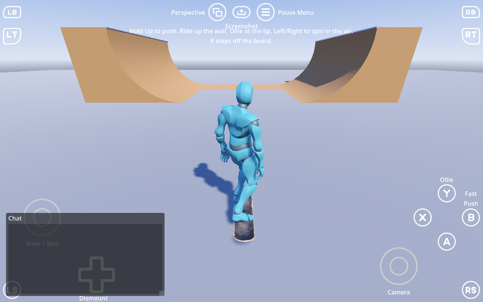

# Tim Cope's Pro Skater (TCPS) for Godot 4.8+

Skateboarding for the [3D Player Controller](../3d_player_controller/README.md): a rideable board with the vert physics of Neversoft's Tony Hawk's Underground source and the THPS camera. The board owns the movement, the sounds and the camera; the Player lends its body, its input and its animations through the controller's `Riding` state, which makes the board's camera current and turns the Player's step-up ray off while the board owns the ground. The board touches no Player flags and no Player UI.

> [!NOTE]
> Requires `addons/3d_player_controller` (the `Player`, its `Riding` state, `ActionPrompt` and the skateboarding animation clips in `player.tscn`). `Skateboard` and `SkateboardCamera` register their class names on their own; enabling the plugin only adds the board to the Create New Node dialog.

---

## Interactive Demo Scene

Open and run **`res://addons/tcps/scenes/skate_park.tscn`**. The Player starts on the board (the scene's `MountTimer` calls the pickup board's `equip()` after 0.3 s). Hold Up to push, let go of push on the transition, Ollie at the lip, steer Left/Right in the air to spin, and K steps off. Hold Up at the lip instead to fly over the deck.

| Node | What it is |
|---|---|
| `Ground` (`CSGBox3D`, group `CONCRETE`) | The flat park floor; the group picks the concrete roll sound. |
| `HalfPipe/LeftTransition`, `RightTransition` (`CSGPolygon3D`, group `WOOD`) | A 3 m radius quarter circle in 3 degree facets with 0.3 m of vert and a 2 m deck, extruded 8 m; the right one is the same polygon rotated 180 degrees. `LeftCoping` / `RightCoping` are decorative, `Flat` is the plywood between them. |
| `QuarterPipe`, `Funbox` (`CSGPolygon3D`, group `WOOD`) | A lone transition and a kicker with a table top. |
| `Player` | `player.tscn`, nothing to set. |
| `Skateboard` | The pickup board (`skateboard.tscn`); `skate_park.gd` equips it through the same path the prompt uses. |

---

## Playing the demo

This repository is private, and GitHub Pages will not serve a private repository on this plan, so there is
no published demo. `demo/` is the project one is built from; fill its ignored `addons/` and open it in
Godot:

```powershell
robocopy . demo/addons/tcps /MIR /XD .git .github demo /XF .gitignore .gitattributes
git clone --depth 1 https://github.com/kirbycope/godot-3d-player-controller-addon.git demo/addons/3d_player_controller
```

---

## How to Use

| Node | Where it goes | Set in the Inspector |
|---|---|---|
| `Skateboard` (instance `scenes/skateboard.tscn`) | On the ground anywhere in your level | Nothing required; the surface groups `WOOD`, `STONE` / `COBBLESTONE` and `CONCRETE` on your floors pick the roll sounds |
| `SkateboardCamera` (inside `skateboard.tscn`) | Nothing to add | `behind`, `above`, `tilt`, the lerp and slerp rates, `lookaround_max` |

Looking at the board and pressing Action mounts it: `Skateboard.equip()` calls `Player.mount()`, the `Riding` state calls back `mount(player)`, and from then on the board's `ride(player, delta)` moves the Player every physics tick (it drives the `CharacterBody3D` and the Player's movement API: velocity, floor settings, `orientation`, `model_pitch`, the model turn helpers and `update_movement_and_rotation`), `ride_input(player, event)` handles the ollie, kick push and dismount through the board's own action exports (resolved for the `input_type` the state keeps current), and `camera` is the current camera. K (or D-pad Down) calls `Player.dismount()`; the board is left where the skater stands and the Player's own camera returns. `get_contextual_controls(input_type)` names the labels (`"joypad_button_3": "Ollie"`), and the board's `GroundRay` picks the roll sound.

Animations are the Player's: the board asks for them through `locomotion_requested("SkateboardingLocomotion" / "SkateboardingKickPush")`, `locomotion_blend_requested`, and `jump_requested`, which the `Riding` state connects to the Player's AnimationTree.

---

## Physics and camera

Ported from the THUG source at https://github.com/thug1src/thug: `Code/Sk/Components/SkaterCorePhysicsComponent.cpp` (`maybe_straight_up`, the vert tracking in `do_in_air_physics`, `maybe_break_vert`, `do_jump`, `handle_ground_rotation`) and `Code/Sk/Objects/skatercam.cpp` (`CSkaterCam::Update`, `GetTripodPos`, `CalculateZoom`).

- On the ground the board follows the floor normal, so speed carries up a transition and gravity along the surface slows the climb; transitions count as floor almost to vertical, a coasting board keeps its speed, and steering turns about the surface normal so a small steer on a wall is a small change along it.
- Leaving a wall steeper than 50 degrees is a vert launch: the velocity is rotated into the wall's vertical plane with its speed kept, and through the air the skater is held in that plane while the wall is still behind them (a ray at launch height), so they come back down onto the same wall, sliding along the lip by however much they were carving. Off the end of the wall it becomes regular air. Holding forward at the lip breaks vert and flies over the deck.
- An ollie pops straight up on the press (a smaller pop off vert); a late pop while falling back in pushes off the wall into the pipe. Left/right spin the skater in the air; every landing turns them to face the way they roll, with the lean flipped along, and the lean itself holds the wall's angle through vert air.
- The camera runs in the physics tick after the board has moved the skater, from a node that is not dragged by the skater's body, reads a smoothed floor normal, and rides through the one-tick contact flicker steep transitions produce.

---

## Tests

```powershell
& 'C:\Godot\godot.exe' --headless --path . -s addons/gut/gut_cmdln.gd -gdir=res://addons/tcps/tests -gexit
```

---

## Assets

| Folder | Source | License |
|---|---|---|
| `assets/sketchfab/skateboard/` | [Skateboard by Jamoues](https://sketchfab.com/3d-models/skateboard-0f7b8ea366654674b217a743959798e7) | CC BY 4.0 |
| `assets/gravitysound/Skateboard SFX/` | [Gravity Sound](https://gravity-sound.itch.io/) | Not recorded - fill in |

---

## License

MIT, see the repository LICENSE.
